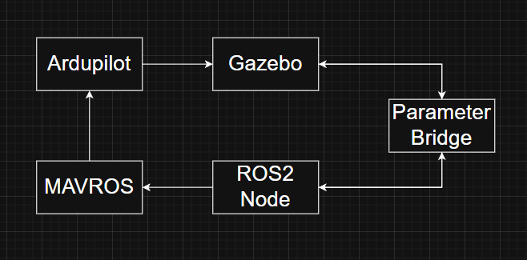

# Pro-Stable Predictive UAV Follower

An autonomous drone tracking system built on ROS 2 Humble and ArduPilot. This project integrates YOLOv5 real-time object detection with a robust PID control system, featuring a specialized Predictive Tracking mechanism to maintain target lock even during brief visual occlusions.

## Key Features

• Real-time YOLOv5 Detection: Utilizes OpenCV's DNN module to run YOLOv5n (ONNX) for high-frequency human detection.
• Predictive Tracking (LOST_RUSH): A custom state machine that predicts target movement when visual contact is lost, preventing the drone from immediate stalling.
• Triple-Axis PID Control: Fine-tuned controllers for Forward Velocity ($V_x$), Horizontal Heading (Yaw), and Target Altitude centering.
• Gazebo Garden Integration: Fully compatible with the modern Gazebo Sim (v4) physics engine.
• Safe-Zone Logic: Includes a "Panic Mode" that triggers an immediate retreat if the target becomes dangerously close to the drone's camera.

## Prerequisites & Environment

• OS: Ubuntu 22.04
• ROS 2: Humble
• Simulator: Gazebo Garden (GZ Sim v4)
• Flight Stack: ArduPilot (SITL)
• OpenCV: 4.5.4 (Optimized for Gazebo/RQT rendering compatibility)
• MAVROS: Binary or source installation

## Quick Start Guide

1. Launch Gazebo Simulation
```
gz sim -v4 -r iris_runway.sdf
```

2. Launch ArduPilot SITL
```
# Navigate to your ArduPilot directory
Tools/autotest/sim_vehicle.py -v ArduCopter -f gazebo-iris --model JSON --map --console
```

3. Initialize ROS-Gazebo Bridge
```
ros2 run ros_gz_bridge parameter_bridge \
"/iris/camera/image_raw@sensor_msgs/msg/Image[gz.msgs.Image" \
"/gimbal/cmd_pitch@std_msgs/msg/Float64]gz.msgs.Double"
```

4. Start MAVROS
```
ros2 run mavros mavros_node --ros-args -p fcu_url:=udp://127.0.0.1:14550@
```

5. Build and Run the Tracker Node
```
# Navigate to your ros2 work directory
colcon build --packages-select drone_tracker
source install/setup.bash
ros2 run drone_tracker drone_tracker_node
```

## Predictive Logic (State Machine)
The core differentiator of this project is the LOST_RUSH state, which handles target loss through inertial prediction:

| State | Behavior Description |
| :--- | :--- |
| **TRACKING** | **Normal Operation:** The PID controllers are active, adjusting $V_x$ and Yaw to keep the target centered and at the desired distance. |
| **LOST_RUSH** | **Prediction Mode:** Triggered when the target is lost. If the target was last seen at the screen edges, the drone continues rotating. If it vanished at the bottom (too close), the drone executes a retreat maneuver to regain visibility. |
| **SEARCHING** | **Recovery Mode:** If the "Rush" period expires without re-detection, the drone initiates a continuous 360° yaw rotation to scan the environment. |

## Architecture diagram



## DEMO
```
Screencast from 04-09-2026 06_01_09 AM.webm
```
